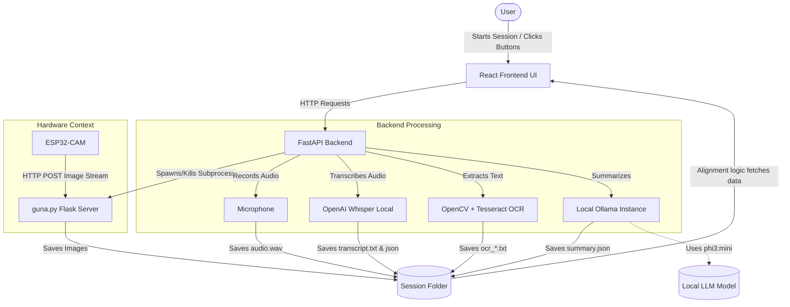

# Suma: Comprehensive Project Documentation

This document contains everything you need to know about the Suma application, including its functionalities, tech stack, setup instructions, execution commands, and an architecture flowchart.

---

## 1. Core Functionalities & How to Use Them

Suma is an AI-powered, offline-first classroom note-taking assistant. It automatically captures audio and visual context, transcribes speech, extracts text from images, aligns them, and generates structured educational summaries.

### 2.1 Multi-modal Recording (Audio + Visual)
*   **What it does:** Records live audio from the laptop microphone while simultaneously receiving photos of the whiteboard/presentation from an ESP32-CAM via a local Flask server (`guna.py`).
*   **How to use:** In the frontend, navigate to the **Capture** tab and click **Start Session**. The system will begin recording your mic and tracking incoming images. Click **Stop Session** to end. *(Note: A 3-minute grace period automatically ensures delayed photos are collected before stopping completely).*

### 2.2 Offline Speech-to-Text (Transcription)
*   **What it does:** Converts spoken audio into text using OpenAI Whisper locally (no cloud API needed), providing timestamps for every segment.
*   **How to use:** Once a session is stopped, click the **Transcribe** button. The system processes the `audio.wav` file and generates `transcript.txt` and `transcript_timed.json`.

### 2.3 Image OCR (Optical Character Recognition)
*   **What it does:** Analyzes the captured whiteboard/presentation images using Tesseract/OpenCV to extract written text.
*   **How to use:** Click the **Run OCR** button in the frontend. It will scan all images in the current session folder and generate `ocr_*.txt` files containing the extracted text.

### 2.4 Audio-Visual Alignment
*   **What it does:** Synchronizes the generated transcript with the captured images based on timestamps.
*   **How to use:** Go to the **Alignment** tab in the frontend. You can view sentences grouped alongside the specific image that was captured around the same time those words were spoken.

### 2.5 AI Summarization
*   **What it does:** Combines the transcription and OCR text, sending it to a local LLM via Ollama to produce a structured summary (core concepts, examples, questions).
*   **How to use:** Click the **Summarize** button. Wait for the background task to complete. The summary will be displayed on the screen and saved as `summary.json`.

---

## 2. Technology Stack

*   **Frontend**: React 19, Vite, JavaScript, CSS (for the user interface)
*   **Backend**: Python, FastAPI, Uvicorn
*   **Audio Recording**: `sounddevice`, `wave`
*   **Speech-to-Text**: `openai-whisper` (Local AI Model)
*   **Image Processing & OCR**: `opencv-python` (cv2), `pytesseract` (Tesseract OCR), `easyocr`
*   **Local LLM Integration**: Ollama (Running `phi3:mini` model)
*   **Hardware Interface**: ESP32-CAM (C++ code via `.ino`), `guna.py` (Flask server acting as a middleman to receive images over WiFi)

---

## 3. Setup Commands

### Step 1: Frontend Setup
```bash
cd frontend
npm install
```

### Step 2: Backend Setup
```bash
cd backend
python -m venv .venv

# On Windows:
.venv\Scripts\activate
# On Mac/Linux:
source .venv/bin/activate

pip install -r requirements.txt
```

### Step 3: Install External System Dependencies
1.  **Ollama**: Install from [ollama.com](https://ollama.com/), then run `ollama pull phi3:mini` in your terminal. Ensure the Ollama app is running in the background.
2.  **Tesseract OCR**: Install the Tesseract engine on your OS and add it to your system PATH.
3.  **ESP32-CAM**: Flash the C++ code (`esp32_cam_classroom.ino`) to your microcontroller using the Arduino IDE.

---

## 4. Commands to Run the Application

You need two separate terminal windows.

### Terminal 1: Start the Backend
```bash
cd backend
# Activate virtual environment
.venv\Scripts\activate  # On Windows
uvicorn main:app --reload --host 0.0.0.0 --port 8000
```
*(Note: The `guna.py` Flask server is automatically managed and launched by `main.py` when a session starts. You do not need to run it manually).*

### Terminal 2: Start the Frontend
```bash
cd frontend
npm run dev
```
Open your browser to `http://localhost:5173` to use the application.

---

## 5. System Architecture Flowchart


